# 02 — Solution Architecture

Figure 1 is the Part 2 deliverable. Zoom-ins: Fig 2 agent graph, Fig 3 taxonomy
governance, Fig 4 guardrails and trust boundaries.

```mermaid
%%{init: {"flowchart": {"useMaxWidth": false}}}%%
flowchart LR
  subgraph SRC["Sources — existing capture (out of scope)"]
    direction TB
    S1[Regulator / FOS]
    S2[Mobile app]
    S3[Branch CRM]
    S4[Call centre audio]
  end

  subgraph TRX["Transcription — separate bounded context"]
    T1["Chirp 3 / STT v2<br/>diarisation + speaker-role attribution"]
  end
  S4 --> T1

  subgraph ING["Ingest &amp; standardisation"]
    direction TB
    I1["Channel adapters<br/>→ ComplaintEnvelope"]
    I2["PII redaction (DLP)<br/>+ pseudonymisation"]
    I3["Injection screen"]
    I1 --> I2 --> I3
  end
  S1 --> I1
  S2 --> I1
  S3 --> I1
  T1 --> I1

  Q[("Quarantine<br/>reason-coded, never dropped")]
  I3 -.->|fail| Q

  CS[("Complaint store · BigQuery<br/>system of record<br/>open + closed w/ resolution notes")]
  I3 --> CS

  E1["Enrichment · map stage<br/>distilled classifier + LLM tail<br/>category · sentiment<br/>evidence spans · confidence"]
  CS --> E1

  F{"Confidence + novelty<br/>thresholds"}
  E1 --> F

  A1["Attribution track<br/>closed-set assignment<br/>against current taxonomy version"]
  F -->|assign| A1

  D1["Discovery track<br/>residual pool → embeddings → clustering<br/>→ cluster linking → candidate themes"]
  F -->|abstain| D1

  TAX[("Taxonomy store<br/>versioned + old→new mapping")]
  TAX -->|read| A1
  CC{{"Taxonomy change control<br/>human approval · periodic"}}
  D1 -->|adoption proposal| CC
  CC --> TAX

  M1["Metrics &amp; fact store<br/>aggregation · channel-normalised sentiment<br/>NB velocity + BH · CUSUM drift<br/>→ facts + metrics brief"]
  A1 --> M1
  D1 -->|candidate counts| M1
  TAX -.->|re-project history| M1

  subgraph AG["Agentic workflow — expanded in Fig 2"]
    G1["plan → investigate → adjudicate<br/>→ remediate → critic → render<br/><i>read-only tools · bounded budgets</i>"]
  end
  M1 -->|metrics brief + facts| G1
  CS -->|exemplar RAG| G1
  RN[("Resolution notes<br/>vector index over closed complaints")]
  CS --> RN
  RN -->|resolution RAG| G1

  R["Report object<br/>versioned · immutable · fact-referenced"]
  G1 --> R

  SO{{"Human sign-off<br/>draft → reviewed → published"}}
  R --> SO
  SO -.->|reviewer edits as labelled data| E1

  subgraph OUT["Outputs"]
    direction TB
    O1["Looker dashboard<br/>drill-down to source complaints"]
    O2["PDF / DOCX committee pack"]
    O3["Email digest"]
  end
  SO --> O1
  SO --> O2
  SO --> O3

  classDef det fill:#e8f0fe,stroke:#1a73e8,color:#202124
  classDef gen fill:#fce8e6,stroke:#d93025,color:#202124
  classDef store fill:#f1f3f4,stroke:#5f6368,color:#202124
  classDef human fill:#e6f4ea,stroke:#137333,color:#202124

  class I1,I2,I3,A1,M1,F,T1 det
  class E1,D1,G1 gen
  class CS,TAX,RN,Q,R store
  class CC,SO human
```



**Colour key:** blue deterministic · red generative · grey store · green human gate.

The seam between the fact store and the agent is the central claim of this
design: every figure the agent can cite was computed by ordinary code before any
model was invoked.

---

## 1 · Sources

Regulator/FOS referrals, mobile app form, branch CRM notes, call centre audio.
Existing capture systems, out of scope. Shown to establish channel diversity,
which drives the standardisation and channel-normalisation decisions downstream.

## 2 · Transcription

**Chirp 3 / STT v2** with diarisation and speaker-role attribution, so agent
scripting can be stripped from customer speech. Emits transcript plus ASR
confidence metadata.

A separate bounded context by design: different SLA, vendor risk, failure modes
and cost curve to the analytics pipeline. Model choice is constrained by UK
regional availability as much as by accuracy. Evaluated on downstream category
F1 impact, not WER alone — beyond a threshold, WER improvements stop moving the
metric that matters.

## 3 · Ingest and standardisation

| Component | Purpose |
|---|---|
| Channel adapters | Map each source into the canonical `ComplaintEnvelope`. Channel-specific messiness is confined here; nothing downstream branches on source format. `channel` is retained as a first-class feature. |
| PII redaction | Cloud DLP removes personal data before any model inference. Pseudonymisation is deterministic and reversible only via a token vault the analytics layer cannot reach. |
| Injection screen | Complaint text is customer-supplied and adversarial-capable. Screened on ingest and treated as untrusted data throughout. |
| Quarantine | Complaints failing redaction, parsing or injection checks are held with a reason code. Complaints are regulatory records and are never silently discarded; quarantine volume is a reported metric. |

## 4 · Stores

**Complaint store (BigQuery)** — system of record for all envelopes, open and
closed. Closed complaints carry resolution notes describing the action taken.

**Resolution notes index** — vector index over resolution notes from closed
complaints, derived and rebuildable. This is the entire knowledge base for
remediation: rather than reasoning about root causes from first principles, the
system retrieves how comparable complaints were actually resolved. At ~250k
complaints/year, BigQuery `VECTOR_SEARCH` is sufficient; Vertex AI Vector Search
is the scale-out path if interactive latency demands it.

**Taxonomy store** — the complaint taxonomy held as versioned data, not code:
node definitions, inclusion/exclusion criteria, exemplars, validity dates, and
old→new mapping tables. Never mutated in place. This is what guarantees
month-to-month comparability.

## 5 · Enrichment (map stage)

Extracts a structured record per complaint: category, sentiment intensity,
evidence spans and confidence.

A distilled encoder classifier handles the bulk; an LLM handles the
low-confidence tail. The hybrid is cheaper, faster, deterministic, versionable
and materially easier to validate than LLM-only classification — while retaining
the LLM's strength on novel and ambiguous cases.

## 6 · Routing: attribution and discovery

The confidence and novelty thresholds fork each enriched record.

**Attribution track** — closed-set assignment against the current taxonomy
version. Produces the numbers behind drivers and sentiment trends, with
comparability guaranteed by version stamping.

**Discovery track** — the residual pool feeds embeddings, clustering, and
cluster linking across weeks so candidate themes (`CT-nnn`) hold stable
identities and their growth can be measured.

**Two routes to taxonomy change**, both human-gated:

| Route | Cadence | Change type | Cost |
|---|---|---|---|
| Discovery over residual pool | Weekly | Additive — new node | Cheap; history unaffected |
| Taxonomy health review | Periodic | Splits, merges, retirements | Breaks the series; needs re-projection |

Splits are signalled by rising within-category embedding variance, merges by
persistently confusable predictions in the sampled audit, retirements by
sustained near-zero volume.

**Note the candidates edge bypasses change control.** Reporting an emerging theme
and adopting it as a category are different acts. Reporting must be fast — lead
time is the entire value of emerging-risk detection. Adoption is structural and
deliberately slow. Candidate themes therefore reach the agent as narrative
findings with evidence, never as rows in the trend table, because they have no
comparable history.

## 7 · Metrics and fact store

Deterministic aggregation and statistics. dbt models over BigQuery for counting;
a Python module for what SQL cannot express.

**Computes:** volumes and rates by category, channel, product and week;
within-channel sentiment aggregation; negative-binomial velocity tests with
Benjamini-Hochberg FDR control; CUSUM drift detection; precomputed segment
breakdowns; health indicators (abstention rate, residual share, quarantine
counts).

**Emits facts** — typed values with provenance:

```python
Fact(
    id="f_0142",
    run_id="2026-W31",
    label="payments_failed · count · 2026-W31",
    value=142,
    unit="complaints",
    taxonomy_version="v4.2",
    provenance=Query(
        view="v_weekly_category_counts",
        params={"category": "payments_failed", "week": "2026-W31"},
    ),
)
```

Facts are written once per run and never mutated. A taxonomy re-projection
produces a new run, not an edit — otherwise a published report stops reconciling
with the store it cites.

**Emits the metrics brief** — built by `build_brief()` from the run's facts using
fixed, configured thresholds. Contains flagged categories, drift signals,
candidate themes, health indicators and headline aggregates, as **fact IDs**, and
is truncated (top 8 flagged, top 3 candidates).

The brief is the agent's entire view of the week. This is deliberate: it bounds
the run, makes weeks comparable, and keeps the agent reproducible. Anything the
thresholds miss cannot appear in the report — which is why thresholds are tuned
against backtest and the minimum detectable effect is declared, and why the
dashboard remains available for analysts who need to look further.

**Why this is a distinct component:** it is the trust boundary; it makes the
agent's tools cheap, parameterised and bounded rather than free-form queries; and
it is independently testable without invoking a model, which is exactly what a
model validator will ask for.

## 8 · Agentic workflow

Bounded LangGraph pipeline. Read-only tools, no write access, no external egress,
budgeted steps.

```
plan → investigate → adjudicate → remediate → critic ⇄ revise → render
```

| Node | Does |
|---|---|
| `plan` | Reads the metrics brief; allocates a bounded set of investigations by excess volume and severity. Skipped items are recorded. |
| `investigate` | Per finding: retrieves exemplar complaints, characterises what customers are actually describing, drafts a finding with citations. |
| `adjudicate` | Per candidate theme: real signal, noise, or ingest artefact? Checks coherence, persistence, and data-quality facts; deduplicates against existing categories. |
| `remediate` | Vector search over similar closed complaints, joined to their resolution notes; assesses whether that precedent genuinely transfers, and summarises what was done and what worked. Retries with widened retrieval if relevance is poor. |
| `critic` | Programmatic verification. Failures return to a bounded revise loop (max 2). |
| `render` | Deterministic templating. No model involvement. |

**Tools:** `query_metrics` (parameterised views only), `get_exemplars`,
`get_precedent`. No free-form SQL.

**The critic enforces:**

- every numeric claim resolves to a fact ID — 100%, an assertion not a metric
- every qualitative claim carries ≥2 complaint citations with valid offsets
- no causal language: "coincident with" is permitted, "caused by" is not; causal
  hypotheses are emitted as requiring confirmation by a named owner
- zero PII in output text
- no unexplained internal acronyms

**What the agent cannot do:** compute any statistic; rank the top 5; modify the
taxonomy; publish; write anywhere; reach the internet.

**Why an agent rather than a prompt chain.** The remediation step is
retrieve → assess relevance → refine, and the number of iterations depends on
what comes back. Candidate adjudication branches on evidence. Neither path is
enumerable in advance. Agency is confined to *what to look at next*; determinism
governs *what the numbers are*.

**Why the LLM types no numbers.** Findings reference fact IDs; values are
substituted at render time. Quotes reference `complaint_id` plus character
offsets and are pulled from the store at render. Numeric hallucination and
misquotation are made structurally impossible rather than detected after the
fact.

**Extension path.** Additional tools — a change/release calendar, known-issue
register, or segment comparison — slot into `investigate` without altering the
graph. The scope here is deliberately the minimum that the available data
supports.

## 9 · Report, sign-off and delivery

**Report object** — versioned, immutable, with claims referencing fact IDs and
complaint offsets. Pins prompt, model and taxonomy versions, so any historical
report is exactly reconstructable.

**Human sign-off** — a named reviewer moves draft → published. Satisfies
accountability expectations and closes the loop: reviewer edits are captured as
labelled data feeding evaluation.

**Outputs** — Looker dashboard for drill-down from any headline figure to the
underlying complaints; PDF/DOCX pack as the immutable committee record; email
digest. The report is the record; the dashboard is the drill-down.

## 10 · Orchestration and platform

Composer or Cloud Workflows for the weekly run; Cloud Run for services and jobs;
Terraform for infrastructure; Artifact Registry; GitHub Actions for CI.

At ~5,000 complaints per week the constraint is analytical quality, not compute
scale. GKE, streaming infrastructure and a dedicated vector database are not
warranted and are deliberately excluded — see *Key decisions* below.

Every run emits a full trace — tool calls, arguments, facts retrieved, prompt and
model versions — to BigQuery. This is what makes a report defensible eighteen
months later.

## Key decisions

This table is the decision record. Each row names what was chosen and what was
considered and rejected; the reasoning is in the section above that the
decision belongs to.

| Decision | Alternatives rejected |
|---|---|
| Distilled classifier + LLM tail | LLM-only; classical ML only |
| Versioned taxonomy as data | Fixed taxonomy; fully dynamic clustering |
| BigQuery vector search | Dedicated vector database |
| Cloud Run + Composer | GKE |
| Constrained agent graph | Single-shot prompt; autonomous ReAct agent |
| Remediation by precedent retrieval | Causal root-cause inference; change-calendar correlation |
| One embedding space over complaint text; precedent matched complaint-to-complaint and joined to its note | A second index over resolution notes; asymmetric complaint→resolution retrieval |
| Facts computed before generation | Post-hoc numeric verification |
| LangGraph as the graph runtime | A bespoke loop; a general agent framework |

The demonstration package substitutes for three of these so that it runs
offline with no credentials. The production choice is on the left.

| Production | Substituted with, in this package |
|---|---|
| BigQuery | DuckDB over Parquet, behind the same repository protocols |
| A hosted embedding model | TF-IDF + truncated SVD |
| Live model calls | Replay of committed cassettes, recorded from the live model |
