# 02 — Solution Architecture

The diagram below is the Part 2 deliverable. Section 8 expands the agentic
workflow, which is the stage implemented in code for Part 3.

```mermaid
%%{init: {"flowchart": {"useMaxWidth": false}}}%%
flowchart LR
  subgraph SRC["Sources — existing capture (out of scope)"]
    direction TB
    S1[Regulator / FOS]
    S2[Mobile app]
    S3[Branch CRM]
    S4[Call centre audio]
  end

  subgraph TRX["Transcription — separate bounded context"]
    T1["Chirp 3 / STT v2<br/>diarisation + speaker-role attribution"]
  end
  S4 --> T1

  subgraph ING["Ingest &amp; standardisation"]
    direction TB
    I1["Channel adapters<br/>→ ComplaintEnvelope"]
    I2["PII redaction (DLP)<br/>+ pseudonymisation"]
    I3["Injection screen"]
    I1 --> I2 --> I3
  end
  S1 --> I1
  S2 --> I1
  S3 --> I1
  T1 --> I1

  Q[("Quarantine<br/>reason-coded, never dropped")]
  I3 -.->|fail| Q

  CS[("Complaint store · BigQuery<br/>system of record<br/>open + closed w/ resolution notes")]
  I3 --> CS

  E1["Enrichment · map stage<br/>distilled classifier + LLM tail<br/>category · sentiment<br/>evidence spans · confidence"]
  CS --> E1

  F{"Confidence + novelty<br/>thresholds"}
  E1 --> F

  A1["Attribution track<br/>closed-set assignment<br/>against current taxonomy version"]
  F -->|assign| A1

  D1["Discovery track<br/>residual pool → embeddings → clustering<br/>→ cluster linking → candidate themes"]
  F -->|abstain| D1

  TAX[("Taxonomy store<br/>versioned + old→new mapping")]
  TAX -->|read| A1
  CC{{"Taxonomy change control<br/>human approval · periodic"}}
  D1 -->|adoption proposal| CC
  CC --> TAX

  M1["Metrics &amp; fact store<br/>aggregation · channel-normalised sentiment<br/>NB velocity + BH · CUSUM drift<br/>→ facts + metrics brief"]
  A1 --> M1
  D1 -->|candidate counts| M1
  TAX -.->|re-project history| M1

  subgraph AG["Agentic workflow — see §8"]
    G1["investigate → adjudicate → remediate<br/>→ critic ⇄ revise → render<br/><i>read-only tools · bounded budgets</i>"]
  end
  M1 -->|metrics brief + facts| G1
  CS -->|exemplar RAG| G1
  RN[("Resolution notes<br/>vector index over closed complaints")]
  CS --> RN
  RN -->|resolution RAG| G1

  R["Report object<br/>versioned · immutable · fact-referenced"]
  G1 --> R

  SO{{"Human sign-off<br/>draft → reviewed → published"}}
  R --> SO
  SO -.->|reviewer edits as labelled data| E1

  subgraph OUT["Outputs"]
    direction TB
    O1["Looker dashboard<br/>drill-down to source complaints"]
    O2["PDF / DOCX committee pack"]
    O3["Email digest"]
  end
  SO --> O1
  SO --> O2
  SO --> O3

  classDef det fill:#e8f0fe,stroke:#1a73e8,color:#202124
  classDef gen fill:#fce8e6,stroke:#d93025,color:#202124
  classDef store fill:#f1f3f4,stroke:#5f6368,color:#202124
  classDef human fill:#e6f4ea,stroke:#137333,color:#202124

  class I1,I2,I3,A1,M1,F,T1 det
  class E1,D1,G1 gen
  class CS,TAX,RN,Q,R store
  class CC,SO human
```



**Colour key:** blue deterministic · red generative · grey store · green human gate.

The seam between the fact store and the agent is the central claim of this
design: every figure the agent can cite was computed by ordinary code before any
model was invoked.

---

## 1 · Sources

Regulator/FOS referrals, mobile app form, branch CRM notes, call centre audio.
Existing capture systems, out of scope. Shown to establish channel diversity,
which drives the standardisation and channel-normalisation decisions downstream.

## 2 · Transcription

**Chirp 3 / STT v2** with diarisation and speaker-role attribution, so agent
scripting can be stripped from customer speech. Emits transcript plus ASR
confidence metadata.

A separate bounded context by design: different SLA, vendor risk, failure modes
and cost curve to the analytics pipeline. Model choice is constrained by UK
regional availability as much as by accuracy. Evaluated on downstream category
F1 impact, not WER alone — beyond a threshold, WER improvements stop moving the
metric that matters.

## 3 · Ingest and standardisation

| Component | Purpose |
|---|---|
| Channel adapters | Map each source into the canonical `ComplaintEnvelope`. Channel-specific messiness is confined here; nothing downstream branches on source format. `channel` is retained as a first-class feature. |
| PII redaction | Cloud DLP removes personal data before any model inference. Pseudonymisation is deterministic and reversible only via a token vault the analytics layer cannot reach. |
| Injection screen | Complaint text is customer-supplied and adversarial-capable. Screened on ingest and treated as untrusted data throughout. |
| Quarantine | Complaints failing redaction, parsing or injection checks are held with a reason code. Complaints are regulatory records and are never silently discarded; quarantine volume is a reported metric. |

## 4 · Stores

**Complaint store (BigQuery)** — system of record for all envelopes, open and
closed. Closed complaints carry resolution notes describing the action taken.

**Resolution notes index** — vector index over resolution notes from closed
complaints, derived and rebuildable. This is the entire knowledge base for
remediation: rather than reasoning about root causes from first principles, the
system retrieves how comparable complaints were actually resolved. At ~250k
complaints/year, BigQuery `VECTOR_SEARCH` is sufficient; Vertex AI Vector Search
is the scale-out path if interactive latency demands it.

**Taxonomy store** — the complaint taxonomy held as versioned data, not code:
node definitions, inclusion/exclusion criteria, exemplars, validity dates, and
old→new mapping tables. Never mutated in place. This is what guarantees
month-to-month comparability.

## 5 · Enrichment (map stage)

Extracts a structured record per complaint: category, sentiment intensity,
evidence spans and confidence.

A distilled encoder classifier handles the bulk; an LLM handles the
low-confidence tail. The hybrid is cheaper, faster, deterministic, versionable
and materially easier to validate than LLM-only classification — while retaining
the LLM's strength on novel and ambiguous cases.

## 6 · Routing: attribution and discovery

The confidence and novelty thresholds fork each enriched record.

**Attribution track** — closed-set assignment against the current taxonomy
version. Produces the numbers behind drivers and sentiment trends, with
comparability guaranteed by version stamping.

**Discovery track** — the residual pool feeds embeddings, clustering, and
cluster linking across weeks so candidate themes (`CT-nnn`) hold stable
identities and their growth can be measured.

**Two routes to taxonomy change**, both human-gated:

| Route | Cadence | Change type | Cost |
|---|---|---|---|
| Discovery over residual pool | Weekly | Additive — new node | Cheap; history unaffected |
| Taxonomy health review | Periodic | Splits, merges, retirements | Breaks the series; needs re-projection |

Splits are signalled by rising within-category embedding variance, merges by
persistently confusable predictions in the sampled audit, retirements by
sustained near-zero volume.

**Note the candidates edge bypasses change control.** Reporting an emerging theme
and adopting it as a category are different acts. Reporting must be fast — lead
time is the entire value of emerging-risk detection. Adoption is structural and
deliberately slow. Candidate themes therefore reach the agent as narrative
findings with evidence, never as rows in the trend table, because they have no
comparable history.

## 7 · Metrics and fact store

Deterministic aggregation and statistics. dbt models over BigQuery for counting;
a Python module for what SQL cannot express.

**Volumes** — counts and rates by category, channel, product and week, offset by
exposure.

**Sentiment** — aggregated strictly *within* channel, then combined with channel
weighting. Raw pooling would track the channel mix rather than sentiment, since
callers are more expressive than form-fillers: a category whose complaints
shifted from the app to the call centre would appear to change tone when only
its mix moved.

**Velocity** — a negative binomial model per category over a trailing 52-week
window. Negative binomial rather than Poisson because complaint counts are
over-dispersed: volume clusters around incidents, campaigns and outages, so
variance exceeds the mean and a Poisson assumption would flag ordinary weeks as
significant.

The multiplicity problem is the real one. With ~40 categories tested every week,
comparing each against last week at the 5% level produces roughly two false
alarms a week, indefinitely, and a report that cries wolf twice a week is worse
than no report. So every category is tested — not just the interesting-looking
ones, because the correction is only valid over the whole family — and
**Benjamini-Hochberg FDR control at q = 0.10** is applied across the family.
FDR rather than family-wise error: the cost of one spurious line in a report a
human reviews is far lower than the cost of missing a genuine emerging problem,
and Bonferroni at 40 tests would miss most real movements.

Two gates, not one. A flag requires `q ≤ 0.10` **and** a movement large enough to
be worth a reader's attention. Significance alone surfaces trivially small moves
in large categories; a threshold alone surfaces noise in small ones.

**Minimum detectable effect** is reported alongside the results, because a null
result is only meaningful with a stated sensitivity: "no significant change in a
category with a baseline of 19" means something quite different from the same
statement about a baseline of 500. Past a few hundred complaints a week it is
week-to-week variability, not sample size, that limits sensitivity — a real
property of over-dispersed count data, and the reason the MDE is published rather
than assumed away.

**Drift** — CUSUM on the rate, catching sustained movement no single week
reveals, reported separately from spikes.

**Health** — abstention rate and reason mix, residual share, quarantine counts,
channel volume bounds. A week outside bounds is marked degraded and alerting is
suppressed: a backdated regulator batch or a channel outage otherwise looks
exactly like signal.

**Emits facts** — typed values with provenance:

```python
Fact(
    id="f_0142",
    run_id="2026-W31",
    label="payments_failed · count · 2026-W31",
    value=142,
    unit="complaints",
    taxonomy_version="v4.2",
    provenance=Query(
        view="v_weekly_category_counts",
        params={"category": "payments_failed", "week": "2026-W31"},
    ),
)
```

Facts are written once per run and never mutated. A taxonomy re-projection
produces a new run, not an edit — otherwise a published report stops reconciling
with the store it cites.

**Emits the metrics brief** — built by `build_brief()` from the run's facts using
fixed, configured thresholds. Contains flagged categories, drift signals,
candidate themes, health indicators and headline aggregates, as **fact IDs**, and
is truncated (top 8 flagged, top 3 candidates).

The brief is the agent's entire view of the week. This is deliberate: it bounds
the run, makes weeks comparable, and keeps the agent reproducible. Anything the
thresholds miss cannot appear in the report — which is why thresholds are tuned
against backtest and the minimum detectable effect is declared, and why the
dashboard remains available for analysts who need to look further.

**Why this is a distinct component:** it is the trust boundary; it makes the
agent's tools cheap, parameterised and bounded rather than free-form queries; and
it is independently testable without invoking a model, which is exactly what a
model validator will ask for.

## 7a · Embedding strategy

**One embedding column, `SEMANTIC_SIMILARITY`, serving every consumer:**
classification, novelty scoring, theme linking, discovery clustering and
precedent retrieval.

A single shared space is a hard requirement for the first four. Taxonomy
centroids and candidate-theme centroids are compared *to each other* when
deduplicating a discovered theme against an existing category, and distances have
to mean the same thing on both sides.

**Precedent retrieval is complaint-to-complaint, not complaint-to-resolution.**
The agent matches a complaint description against the complaint text of closed
cases, then joins to their resolution notes:

```sql
VECTOR_SEARCH(v_precedent_embeddings, query_vector, top_k => 20)
  → JOIN complaints → return complaint text + resolution_note
```

That is a symmetric like-for-like comparison, so one embedding space is correct
and no separate resolution index is needed. Searching the notes directly would be
*asymmetric* retrieval — the query is a description of a problem, the documents
are terse, jargon-heavy accounts of what a handler did about one — so the
embedding would have to bridge "customer could not make a payment" to "reversed
the fee and reset the payee limit". Complaints are richer, more consistent, and
already in the space the query is written for.

Two consequences worth stating:

- Retrieval *by resolution content* ("cases where the fix was a fee reversal") is
  not supported. It is not required by the four outputs and would need a second
  index.
- The search must be restricted to closed complaints that have a note **before**
  ranking, not filtered afterwards, or recall degrades silently whenever the
  nearest complaints happen to be open.

## 8 · Agentic workflow

Bounded LangGraph pipeline. Read-only tools, no write access, no external egress,
budgeted steps.

```
investigate → adjudicate → remediate → critic ⇄ revise
```

| Node | Does |
|---|---|
| `investigate` | Per flagged category, in the order the metrics layer ranked them: retrieves exemplar complaints, characterises what customers are actually describing, drafts a finding with citations. |
| `adjudicate` | Per candidate theme: real signal, noise, or ingest artefact? Weighs coherence, persistence, channel spread and duplicate ratio against the evidence; deduplicates against existing categories. |
| `remediate` | Vector search over similar closed complaints, joined to their resolution notes; assesses whether that precedent genuinely transfers, and summarises what was done and what worked. Widens retrieval beyond the category and retries if too little transfers. |
| `critic` | Programmatic verification. Failures return to a bounded revise loop (max 2). |
| `revise` | Re-prompts with the specific checks that failed, on the same retrieved evidence. |

**Tools:** `get_exemplars` and `get_precedent`, both parameterised, both
read-only, both budgeted. There is no method anywhere in the reachable graph
that takes SQL.

**Rendering is deliberately not a node.** It is deterministic templating with no
model involvement, so it runs after the graph against verified state. Putting it
in the graph would place the one stage that must never vary — the stage that
substitutes real figures into prose — inside a revision loop.

**Ordering is not the agent's to choose.** Which movements matter is a
statistical question the metrics layer has already answered, so the brief arrives
ranked and the investigation budget drops the weakest movements rather than an
arbitrary tail. An earlier design had the model plan its own investigations; its
output was then validated against the brief and truncated to budget anyway, so
the node was removed.

**The critic enforces five checks, all programmatic:**

| Check | Enforces |
|---|---|
| `facts_resolve` | Every referenced fact ID exists. An ID that does not resolve means a figure was invented. |
| `no_literal_numbers` | No figure typed in prose, as digits or spelled out. The complement of the above: an ID that resolves proves nothing if the model also typed "142" beside it. |
| `citations_present` | Every qualitative claim carries ≥ 2 complaint citations. Two rather than one, because a single complaint is an anecdote. |
| `citations_resolve` | Offsets return the text they claim. This is what makes misquotation structurally impossible rather than detected afterwards. |
| `no_pii` | No personal data in output, scanned over resolved quotations as well as model prose — a quote pulled from the store can carry an identifier redaction missed. |

The first two run over **everything the model wrote that reaches the reader**,
not only over findings. A theme the agent *rejects* never becomes a finding but
its rationale is still published in §3, and a recommendation is published in §4 —
so verifying findings alone would leave both unchecked. `citations_resolve`
likewise covers every span the report quotes, in either section.

`citations_present` is the exception, and deliberately so: it is a rule about
*claims*. A recommendation is grounded by a named precedent the agent judged to
transfer — enforced in `remediate`, which makes no recommendation at all when the
widened retrieval still turns up nothing applicable — and a citation count is the
wrong instrument for that.

No model is involved in verification. These are assertions about structure and
provenance, not judgements about quality, which is precisely why they can be
trusted to gate the render stage: a model grading another model's output would
inherit its failure modes, whereas a regular expression and a lookup in the fact
store do not.

`facts_resolve` and `citations_resolve` are assertions, not metrics — they are
expected to pass at 100%, and a failure fails the run.

**What the agent cannot do:** compute any statistic; rank the drivers; modify the
taxonomy; publish; write anywhere; reach the internet. These are absent from the
tool interface rather than forbidden by instruction, which is the only form of
prohibition that survives an adversarial input.

**Untrusted text has exactly one entry point.** Complaint text is
customer-supplied and adversarial-capable, and it is data — never instruction —
at every point it enters a prompt, including text returned by retrieval, which is
the case people forget. All of it passes through a single fencing function that
makes the boundary explicit, neutralises delimiter escapes, and keeps identifiers
*outside* the quoted block so a payload cannot forge a citation.

Every neutralisation rule must preserve length. The model produces citation
offsets against the text it was shown and the renderer slices those offsets out
of the *stored* text, so a sanitiser that shortened the text by one character
would silently shift every quotation in the report — a failure invisible at the
point it occurs, because the report still renders.

This does not make injection impossible; nothing at the prompt layer can. That is
why the real defences are structural and downstream: the model cannot emit a
figure, cannot cite a complaint it was not given, and every claim is verified
against the store before rendering. A successful injection can make the model
write something odd. It cannot make the report contain a false number or a
fabricated quote.

**Why an agent rather than a prompt chain.** The remediation step is
retrieve → assess relevance → refine, and the number of iterations depends on
what comes back. Candidate adjudication branches on evidence. Neither path is
enumerable in advance. Agency is confined to *what to look at next*; determinism
governs *what the numbers are*.

**Why the LLM types no numbers.** Findings reference fact IDs; values are
substituted at render time. Quotes reference `complaint_id` plus character
offsets and are pulled from the store at render. Numeric hallucination and
misquotation are made structurally impossible rather than detected after the
fact.

**Extension path.** Additional tools — a change/release calendar, known-issue
register, or segment comparison — slot into `investigate` without altering the
graph. The scope here is deliberately the minimum that the available data
supports.

## 9 · Report, sign-off and delivery

**Report object** — versioned, immutable, with claims referencing fact IDs and
complaint offsets. Pins prompt, model and taxonomy versions, so any historical
report is exactly reconstructable.

**Human sign-off** — a named reviewer moves draft → published. Satisfies
accountability expectations and closes the loop: reviewer edits are captured as
labelled data feeding evaluation.

**Outputs** — Looker dashboard for drill-down from any headline figure to the
underlying complaints; PDF/DOCX pack as the immutable committee record; email
digest. The report is the record; the dashboard is the drill-down.

## 10 · Orchestration and platform

Composer or Cloud Workflows for the weekly run; Cloud Run for services and jobs;
Terraform for infrastructure; Artifact Registry; GitHub Actions for CI.

At ~5,000 complaints per week the constraint is analytical quality, not compute
scale. GKE, streaming infrastructure and a dedicated vector database are not
warranted and are deliberately excluded — see *Key decisions* below.

Every run emits a full trace — tool calls, arguments, facts retrieved, prompt and
model versions — to BigQuery. This is what makes a report defensible eighteen
months later.

## Key decisions

This table is the decision record. Each row names what was chosen and what was
considered and rejected; the reasoning is in the section above that the
decision belongs to.

| Decision | Alternatives rejected |
|---|---|
| Distilled classifier + LLM tail | LLM-only; classical ML only |
| Versioned taxonomy as data | Fixed taxonomy; fully dynamic clustering |
| BigQuery vector search | Dedicated vector database |
| Cloud Run + Composer | GKE |
| Constrained agent graph | Single-shot prompt; autonomous ReAct agent |
| **Facts computed before generation, referenced by ID, substituted at render time** | Post-hoc numeric verification, which can only ever *detect* a fabricated figure. Here the model has no field to put a number in, so numeric hallucination is structurally impossible instead |
| **Quotations sliced from the store at render time using complaint ID plus character offsets** | Letting the model reproduce the text it quotes, which makes misquotation possible and then requires a diff to catch |
| **Programmatic critic** | An LLM-as-judge, which would inherit the failure modes of the model it is grading. A regular expression and a store lookup do not |
| **Rendering outside the graph** | A `render` node, which would put the one stage that must never vary inside reach of a revision loop |
| **Ranking decided by the metrics layer; the agent investigates in that order** | A `plan` node choosing its own investigations — its output had to be validated against the brief and truncated to budget anyway, so it added a model call and changed nothing |
| Remediation by precedent retrieval | Causal root-cause inference; change-calendar correlation |
| One embedding space over complaint text; precedent matched complaint-to-complaint and joined to its note | A second index over resolution notes; asymmetric complaint→resolution retrieval |
| **Adjudication on four cluster signals — coherence, persistence, channel spread, duplicate ratio** | Coherence alone, which points the *wrong way*: in the demonstration fixture the duplicated CRM notes measure 0.95 and the genuine emerging theme 0.12, because near-identical text is trivially coherent. Anything adjudicating on coherence alone would accept the decoy and reject the real signal |
| **Untrusted text fenced at a single choke point, with length-preserving neutralisation** | Sanitising at each call site, which erodes silently; stripping markers, which shifts every citation offset in the report while still rendering successfully |
| **Sentiment trends rendered deterministically from the brief and carried on the report object** | A model-authored sentiment section, which would put a model in the path of a figure; passing the brief to the renderer instead, which would leave the report object unable to reproduce its own Markdown |
| **Benjamini-Hochberg FDR control across the whole family of category tests** | Uncorrected weekly comparison, which produces ~2 false alarms a week at 40 categories; Bonferroni, which would miss most real movements |
| LangGraph as the graph runtime | A bespoke loop; a general agent framework |

### What the demonstration package substitutes

So that it runs offline in seconds with no credentials. The production choice is
on the left.

| Production | Substituted with, in this package |
|---|---|
| BigQuery, behind repository methods | The same methods over an in-memory fixture |
| A hosted embedding model | TF-IDF + truncated SVD, which captures term co-occurrence rather than meaning |
| The metrics layer (§7) | Its output, committed as `fixtures/facts.json` and `fixtures/brief.json` |
| ~5,000 complaints/week | ~50 hand-written complaints, small enough that a reviewer can read them |
| Live model calls | Replay of committed recordings, made against the live model |
